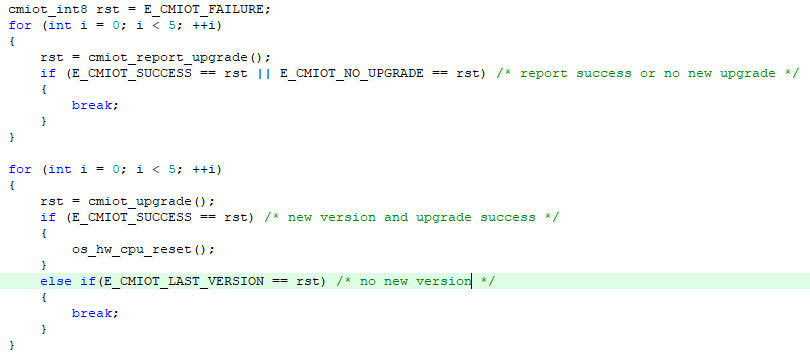
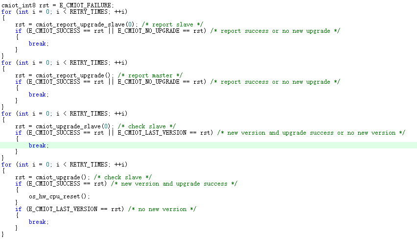

# 远程升级组件

- [**简介**](#简介)
- [**API介绍**](#API介绍)
- [**配置选项**](#配置选项)
- [**应用示例**](#应用示例)
- [**常见错误码含义**](#常见错误码含义)
- [**FAQ**](#FAQ)

## 简介

远程升级（Firmware Over The Air）可通过无线网络实现固件升级。OneOS的OTA为差分升级，采用此方式可极大降低升级包的大小。OneOS OTA组件分两部分：BootLoader和App，BootLoader实现固件还原功能、升级功能，App部分完成更新检测、固件下载、版本校验。


BootLoader获取方式：加入官方开发者交流QQ群158631242，由技术支持来提供。


**下载协议所有板子目前都可支持，列举部分板子差分算法的支持情况**（RAM > 200k，可以考虑使用Wosun；RAM > 512k，可以考虑使用Wosun high）：

**注1：如果使用串口通信，buffer推荐设置成512或更大，以免下载升级包出错**

STM32F091：支持LUSUN。

STM32F103：支持LUSUN。 

STM32F407：支持LUSUN。

STM32F429：支持LUSUN。

STM32F469：支持LUSUN。

STM32F769：支持LUSUN。

STM32F767：支持LUSUN。

STM32L475：支持LUSUN。

STM32F496：支持LUSUN。


## API介绍

**API列表**

无需调用表示：该接口无需OTA使用人员主动调用，OTA在需要的时候会自动调用，使用者只用根据自己的需求来重写。

| **接口**                   | **说明**                                                     |
| :------------------------- | :----------------------------------------------------------- |
| cmiot_get_network_type     | OTA组件使用的通信网络类型，用于在服务端显示，目前可保持默认值，无需调用 |
| cmiot_get_uniqueid         | 端侧的MID，最大30字节，无需调用                              |
| cmiot_app_name             | APP分区的名字，无需调用                                      |
| cmiot_download_name        | DOWNLOAD分区的名字，无需调用                                 |
| cmiot_printf               | OTA组件日志输出接口，当前默认用ONEOS内核的日志输出接口，用户可更改，无需调用 |
| cmiot_msleep               | OTA延时接口，当前默认用ONEOS内核的延时接口，用户可更改，无需调用 |
| cmiot_get_now_time         | 获取当前的时间，单位是毫秒，当前默认通过ONEOS内核TICK转换获取，用户可更改，无需调用 |
| cmiot_reboot_device        | 重启设备，从设备需要使用，默认调用驱动框架相关接口，用户可更改，无需调用 |
| cmiot_upgrade              | 开始检测下载固件包（在多设备方案中，为主设备的接口）         |
| cmiot_report_upgrade       | 上报升级结果（在多设备方案中，为主设备的接口）               |
| cmiot_upgrade_slave        | 多设备方案中，从设备开始检测下载固件包                       |
| cmiot_report_upgrade_slave | 多设备方案中，从设备上报升级结果                             |


**API说明**

**cmiot_get_network_type**

该函数用于获取网络类型，其函数原型如下：

```c
cmiot_char *cmiot_get_network_type(void);
```

| **参数**     | **说明**                       |
| :----------- | :----------------------------- |
| 无           | 无                             |
| **返回**     | **说明**                       |
| cmiot_char * | 网络类型，用户自定义，不能为空 |

**cmiot_get_uniqueid**

该函数用于获取端侧的MID，其函数原型如下：

```c
void cmiot_get_uniqueid(cmiot_char *uid);
```

| **参数** | **说明**                          |
| :------- | :-------------------------------- |
| uid      | 用于设置MID的内存地址，最大30字节 |
| **返回** | **说明**                          |
| 无       | 无                                |

**cmiot_app_name**

该函数用于获取APP分区的名字，其函数原型如下：

```c
cmiot_char *cmiot_app_name(void);
```

| **参数**     | **说明**              |
| :----------- | :-------------------- |
| 无           | 无                    |
| **返回**     | **说明**              |
| cmiot_char * | APP分区名字，不能为空 |

**cmiot_download_name**

该函数用于获取DOWNLOAD分区的名字，该函数原型如下：

```c
cmiot_char *cmiot_download_name(void);
```

| **参数**     | **说明**                   |
| :----------- | :------------------------- |
| 无           | 无                         |
| **返回**     | **说明**                   |
| cmiot_char * | DOWNLOAD分区名字，不能为空 |

**cmiot_printf**

该函数用于日志输出，该函数原型如下：

```c
void cmiot_printf(cmiot_char *data, cmiot_uint32 len);
```

| **参数** | **说明**         |
| :------- | :--------------- |
| data     | 需要输出的字符串 |
| len      | 字符串长度       |
| **返回** | **说明**         |
| 无       | 无               |

**cmiot_msleep**

该函数用于延时，该函数原型如下：

```c
void cmiot_msleep(cmiot_uint32 time);
```

| **参数** | **说明**       |
| :------- | :------------- |
| time     | 延时，单位毫秒 |
| **返回** | **说明**       |
| 无       | 无             |

**cmiot_get_now_time**

该函数用于获取当前时间，该函数原型如下：

```c
cmiot_uint32 cmiot_get_now_time(void);
```

| **参数**     | **说明**           |
| :----------- | :----------------- |
| 无           | 无                 |
| **返回**     | **说明**           |
| cmiot_uint32 | 当前时间，单位毫秒 |

**cmiot_reboot_device**

该函数用于重启设备，该函数原型如下：

```c
void cmiot_reboot_device(void);
```

| **参数** | **说明** |
| :------- | :------- |
| 无       | 无       |
| **返回** | **说明** |
| 无       | 无       |

**cmiot_upgrade**

该函数开始检测下载固件包，其函数原型如下：

```c
cmiot_int8 cmiot_upgrade(void);
```

| **参数**             | **说明**                          |
| :------------------- | :-------------------------------- |
| 无                   | 无                                |
| **返回**             | **说明**                          |
| E_CMIOT_SUCCESS      | 有包且下载成功                    |
| E_CMIOT_FAILURE      | 下载失败                          |
| E_CMIOT_NOT_INITTED  | OTA组件初始化失败，一般是内存不够 |
| E_CMIOT_LAST_VERSION | 没有新的固件包                    |

**cmiot_report_upgrade**

该函数用于上报升级结果，其函数原型如下：

```c
cmiot_int8 cmiot_report_upgrade(void);
```

| **参数**            | **说明**                          |
| :------------------ | :-------------------------------- |
| 无                  | 无                                |
| **返回**            | **说明**                          |
| E_CMIOT_SUCCESS     | 有升级结果且上报成功              |
| E_CMIOT_FAILURE     | 有升级结果但上报失败              |
| E_CMIOT_NO_UPGRADE  | 没有升级结果                      |
| E_CMIOT_NOT_INITTED | OTA组件初始化失败，一般是内存不够 |


**cmiot_upgrade_slave**

该函数开始检测下载从设备固件包，其函数原型如下：

```c
cmiot_int8 cmiot_upgrade_slave(cmiot_int16 slave_num);
```

| **参数**             | **说明**                          |
| :------------------- | :-------------------------------- |
| slave_num            | 从设备标记                        |
| **返回**             | **说明**                          |
| E_CMIOT_SUCCESS      | 有包且下载成功                    |
| E_CMIOT_FAILURE      | 下载失败                          |
| E_CMIOT_NOT_INITTED  | OTA组件初始化失败，一般是内存不够 |
| E_CMIOT_LAST_VERSION | 没有新的固件包                    |

**cmiot_report_upgrade_slave**

该函数用于上报从设备升级结果，其函数原型如下：

```c
cmiot_int8 cmiot_report_upgrade_slave(cmiot_int16 slave_num);
```

| **参数**            | **说明**                          |
| :------------------ | :-------------------------------- |
| slave_num           | 从设备标记                        |
| **返回**            | **说明**                          |
| E_CMIOT_SUCCESS     | 有升级结果且上报成功              |
| E_CMIOT_FAILURE     | 有升级结果但上报失败              |
| E_CMIOT_NO_UPGRADE  | 没有升级结果                      |
| E_CMIOT_NOT_INITTED | OTA组件初始化失败，一般是内存不够 |


## 配置选项

**menuconfig配置：**

1.board boot配置

ota组件需要bootloader支持，烧录bootloader文件后，app的起始地址和app的大小要更改才能跳转成功。在menuconfig的Drivers→ Boot→ CORTEX-M Boot→ Board boot configure进行芯片启动相关设置。

```
(Top) → Drivers→ Boot→ CORTEX-M Boot→ Board boot configure
                                                         OneOS Configuration
(0x08000000) text section addr
(0x00080000) text section size
(0x20000000) data section addr
(0x00008000) data section size
```

**注1：不同的联网方式会改变app大小，需要根据使用场景调整app及bootloader分区大小，不然会跳转失败**


2.选择合适的联网方式

**注2：使用串口收发数据时，buffer推荐设置为512或更大;如果接收数据丢失，查看RX是否配置为DMA接收模式，通过ctwing转发的方案不需要关注**


3.OTA相关信息配置

需要更改的地方为：1、设备的类型，2、下载的方案，3、下载的方式，4、差分的算法，5、下载块大小，6、OTA平台相关的值，7、其他平台的值
目前支持三种设备类型：1、单设备，2、多设备的主设备，3、多设备的从设备。三种下载方案：1、直接对接OTA平台的general方案，2、通过CMS中转的cms方案，3、通过ctwing转发的ctwing方案。多设备目前仅支持general下载方案，general和cms下载方式支持HTTP和COAP，ctwing方案仅支持coap，差分的算法目前支持LUSUN、WOSUN LOW、WOSUN HIGH，BootLoader和App需要保持算法一致。App对应的配置选项如下。

```
(Top) → Components→ OTA→ Fota by CMIOT
                                        OneOS Configuration
[*] Enable fota by cmiot
        The supported device type (single device)  --->
        The supported download solution (general)  --->
        The supported network protocol (Http)  --->
        The supported algorithm (Lusun)  --->
(200)   The network timeout
```

**注3：多设备的适配请参照[README_MULTI.md](./README_MULTI.md)**

每次下载的分块大小。

```
(3)     Segment size index
```

如果使用Wosun 差分算法，还需要配置如下两项：

```
(0x8020000) App part addr from fal's OS_APP_PART_ADDR
(0x20000) Download part size from fal's OS_DL_PART_SIZE
```

分别把OS_APP_PART_ADDR和OS_DL_PART_SIZE算出来的值填入即可，这是制作差分包时，平台需要的信息。

如果使用Luckpand差分算法，还需要配置如下：

```
(oneos1.bin) First file name
(0x8010000) First file address base
[*]     Use full
[*]     More file
(oneos2.bin) Second file name
(0x8020000) Second file address base
[ ]         Use full
[ ]         More file
```

选了Luckpand差分算法后，其中的单个文件还是可以指定不用差分，使用全量来制作版本包。


4.与平台相关配置：

```
(cmiot_cd) Oem
(F103RE) Model
(1593394730) Product id
(e7f48e3ea6c3417d82edfe66b1305ac8) Product secret
(box)   Device type
(STM32F1) Platform
(5.0)   Firmware version
```

**注4：须保持与OTA平台侧项目信息一致，通过CMS转发的方案部分配置项没有，不需要关注，CMS组件和平台如何使用请参照对应文档**

**注5： Firmware version  是制作出软件包的版本，改变此值后在KEIL里编译会生成相应版本的软件包，之后即可在OTA平台上传制作差分包**


5.Ctwing方案下相关配置

```
(15056578) Ctwing product attribute id
(999)   Ctwing fota service id
(1)     The msg type report to ctwing
```

**注6： Ctwing方案终端和平台如何配套使用，请参照[README_CTWING.md](./README_CTWING.md)**


**工程构建：**

1.打包命令可以加到Keil软件里，也可以自己手动在scons或cmd命令行打包。命令为：

压缩软件支持：WinRAR.exe、7z.exe

```
目标文件为单个axf文件的打包命令：cmiot_pack.bat fromelf程序路径 压缩软件路径 oneos_config.h axf文件路径
目标文件为单个bin文件的打包命令：cmiot_pack.bat 压缩软件路径 oneos_config.h bin文件路径
目标文件为多个bin文件的打包命令：cmiot_pack.bat 压缩软件路径 oneos_config.h bin文件夹路径

例如：
目标文件为单个axf文件：..\..\components\ota\cmiot\pack\cmiot_pack.bat "D:\Keil_v5\ARM\ARMCC\bin\fromelf.exe" "C:\Program Files\WinRAR\WinRAR.exe" oneos_config.h build\keil\Obj\oneos.axf
目标文件为单个bin文件：..\..\components\ota\cmiot\pack\cmiot_pack.bat "C:\Program Files\WinRAR\WinRAR.exe" oneos_config.h ..\..\out\stm32l475-atk-pandora\oneos.bin
目标文件为多个bin文件：..\..\components\ota\cmiot\pack\cmiot_pack.bat "C:\Program Files\WinRAR\WinRAR.exe" oneos_config.h ..\..\out\stm32l475-atk-pandora\
```

**注7：WinRAR.exe和fromelf.exe是绝对路径，需要根据个人电脑相应路径进行修改**


**OTA云平台制作差分包**

1.平台建项目的时候注意选精简版，我们的板子只支持这个。OTA类型选择精简版。

2.差分对比块大小和驱动一样，配置为块大小。


3.如果使用WOSUN，在OTA平台制作差分包时需要设置设备内存，设置为(RAM总大小 - 10)


## 应用示例

1、包含头文件

```
#include <cmiot_user.h>
```

2、添加上报升级结果和升级更新的代码

单设备如下：



多设备如下：



## 常见错误码含义

当接口执行不成功时，会有日志打印具体的错误码，表示具体的异常情况。日志开头为：Maybe some errors, process termination, error code:，冒号后面为具体错误码，其详细情况如下：

1001：项目ID和平台是否一致。

1002：项目不存在，需要对比终端配置的Oem、Model、Device type、Platform和平台是否一致。

1005：终端Flash操作失败，终端擦写读flash有问题，需要检查相关的驱动程序或硬件。

1008：MID长度错误，MID最少4个字符，最多31个字符。

1010：达到设备访问上限，该设备的单日访问量达到上限了。

1015：达到用户访问上限，该设备所属用户的单日访问量达到上限了。

2001：签名不对，需要对比终端配置的Product Id、Product secret和平台是否一致，如果一致，把flash下载分区擦除一下。

2101：没有新版本，该设备正在运行的版本已经是最新版本。

2103：设备没有注册，一般在测试的时候出现，把flash下载分区擦除一下基本可以解决。


## FAQ

Q：OTA组件资源占用大吗？

A：相对较小，FLASH占用9K以内，RAM占用3K以内（包括RW，ZI，堆，栈）。

Q：cmiot_upgrade()接口我该怎么调用？

A：OTA组件只提供机制，策略性的东西需要用户来定，比如可以每天检测一次，也可以每周检测一次，可以下载完就重启升级，也可以等别的业务完成再重启升级。

Q：调用cmiot_upgrade()接口总是超时是什么原因？

A：请根据网络适当加大接收超时时间，在menuconfig里修改The network timeout即可。

Q：假如文件下载快完成了，突然中断了，下次下载会从头开始下载吗？

A：不会的，会从中断的地方开始下载。
