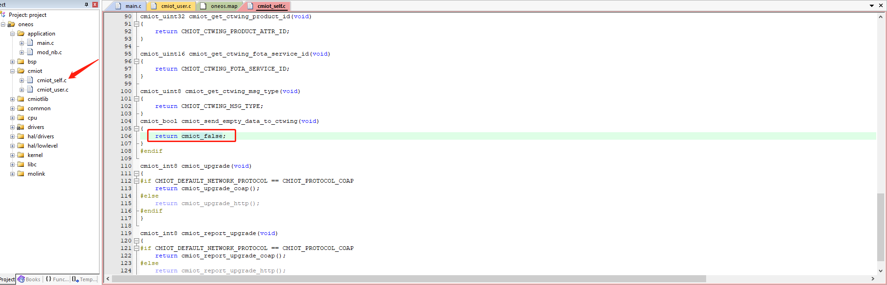

# CTW方案配置说明

- [**电信云平台设置**](#电信云平台设置)
  - [**创建第三方应用**](#创建第三方应用)

  - [**创建产品**](#创建产品)

  - [**建立属性**](#建立属性)
    - [**fota_data属性**](#fota_data属性)
    - [**product_id属性**](#product_id属性)
    - [**业务数据属性**](#业务数据属性)
    
  - [**建立服务**](#建立服务)
  - [**fota数据上传服务**](#fota数据上传服务)
  - [**fota指令下发服务**](#fota指令下发服务)
    - [**用户业务上报服务**](#用户业务上报服务)
    
  - [**设置消息路由**](#设置消息路由)

  - [**添加规则引擎**](#添加规则引擎)

- [**提交账号信息**](#提交账号信息)
- [**Fota平台配置**](#Fota平台配置)
- [**端侧配置**](#端侧配置)
- [**使用注意事项**](#使用注意事项)
- [**业务数据请求**](#业务数据请求)
  - [**上传业务数据只包含业务数据**](#上传业务数据只包含业务数据)
  - [**上传业务数据包含fota_data**](#上传业务数据包含fota_data)

## 电信云平台设置

### 创建第三方应用

如图，在应用管理中创建第三方应用，应用名称、应用分类、应用描述按实际使用填写，是否在AEP选择是，应用权限为AEP自身能力。

### 创建产品

产品名称、产品分类、设备型号等字段根据产品自定义填写。

节点类型：选择设备

接入方式：设备直连

网络类型：NB-IoT

通信协议：LWM2M

数据加密方式：明文

认证方式：IMEI认证

Endpoint格式：imei

是否已有电信官方认证通过的profile：否

是否透传：否

消息格式：JSON/紧凑型二进制（对应设备选择的数据传输方式，这里以JSON格式为例说明）

### 建立属性

在产品中的服务定义中建立属性，FOTA需要2个属性，接口入口如下图。

#### fota_data属性

属性标识必须为fota_data，属性为string类型，用于包含fota的数据，最好设置最大数据长度1024以上，这里设置的2048。

#### product_id属性

属性标识必须为product_id，属性为int32类型，用于传输ctw平台产品字段。

#### 业务数据属性

用户需要传送到自己平台的业务数据，本字段按用户自己需求定义，示例中标识位data。

### 建立服务

在产品服务定义中服务列表中建立服务，fota需要2条服务分别用于上传数据和下发指令，配置入口如下图。

#### fota数据上传服务

数据上传服务，上报请求数据用的服务，需要包含fota_data，product_id两条属性，配置如下。

数据类型：数据上报

服务ID：可自定义，在端侧配置相同ID即可

服务名称：可自定义

服务标识：fota_data_report

参数列表：添加属性中配置的fota_data和product_id属性对应的属性名称

#### fota指令下发服务

指令下发服务，用于将fota平台返回数据下发到设备，需要包含fota_data属性，配置如下。

服务类型：指令下发

服务ID：可自定义

服务名称：可自定义

服务标识：fota_data_distribute

参数列表：添加建立的fota_data属性对应属性名称

#### 用户业务上报服务

自定义服务，用户自身需要上传到自己平台的一些业务服务，这里给个参考设置，具体配置根据用户自身服务定义，示例中服务ID位789，服务标识为data。

 

### 设置消息路由

在消息流转->目的地管理中的HTTP添加新增目的，URL自动填写[http://218.201.45.140:58084/ctwpush/devicedata](http://218.201.45.140:58084/ctwpush/devicedata)，不使用消息加密，该地址fota平台接受规则引擎转发数据的地址，之后再按照用户自身数据要求，添加转发到业务服务器的地址。

 

### 添加规则引擎

规则引擎配置可参考[https://www.ctwing.cn/gzyq/107#/callback](https://www.ctwing.cn/gzyq/107#/callback)配置。

在规则引擎中，创建规则引擎，使用可视化创建。

选择简单规则，产品选择需要的产品，如demo，数据级别选择产品级别。

选择字段中，在字段列表中勾选fota_data和product_id两个属性字段以及自定义函数列表中的获取设备ID。

选择条件中选择fota_data字段<>空（既foat_data字段不是空就匹配）。

点击保存，提交前添加规则描述。

创建转发数据。

选择操作：为发送到HTTP(S)接口

HTTP(S)接口：选择消息路由中设置的fota平台地址

参数模板：{"product_id":"%product_id%","deviceId":"%func-deviceId%","fota_data":"%fota_data%"}，既分别发送产品id，设备id，fota请求数据到fota平台

点击返回规则列表，选择启用规则。

这时fota数据的规则已经配置好了，可以参考fota数据的规则配置业务数据的规则，匹配条件改为fota_data字段为空即可。

## 提交账号信息

这是在ctw平台的配置除去产品中添加设备外其他配置已经完成。

为了保证规则引擎转发功能能正常使用，需要提交部分产品信息到项目接口人，需要提交的信息有。

产品ID和Master-APIkey

第三方应用中的App Key和App Secret

## Fota平台配置

在fota平台上[https://os.iot.10086.cn/otaplatform/ProjectHome](https://os.iot.10086.cn/otaplatform/ProjectHome)，添加项目

项目名称：可自定义，用于界面显示

OEM：可自定义，用于端侧配置

平台：按产品使用的型号选择，用于端侧配置

操作系统：选择RTOS

设备类型：按产品选择

设备型号：可自定义，用于端侧配置

OTA类型：必须选择精简版

## 端侧配置

端侧使用OneOS_cube，menuconfig中的Components-OTA-Fota by CMIOT中配置，配置信息如图。

Oem：对应fota平台中的OEM字段

Model：对应fota平台中设备型号字段

Product id：对应fota平台中的product ID

Product secret：对应fota平台中的Product secret

Device type：对应fota平台中的设备类型

Platform：对应fota平台中的平台

Ctwing product id：对应ctw平台中的产品id

Ctwing fota data report service id：对应ctw平台中fota数据上报的服务id

The msg type report to ctwing：对应ctw平台中建立产品时选择的消息格式，支持JSON（2）和紧凑二进制（1）

## 使用注意事项

上传消息格式请参考ctw平台说明[https://www.ctwing.cn/sbjr/32](https://www.ctwing.cn/sbjr/32)。

## 业务数据请求

上传业务数据有两个使用方式。

### 上传业务数据只包含业务数据

此情景上传的业务请求只包含业务数据，比如JSON格式消息为

{"product_id":15059965," data":"123456”}

这种情景下，因为规则引擎设置的是fota_data字段为空转发业务平台，fota_data字段不为空转发fota平台，所以在业务消息中没有见fota_data置空，只能在每次请求完成fota后发送一条消息将fota_data字段置空。

这样因为fota_data置空的这条消息能匹配转发业务平台，所以业务平台会再次转发条最后保存的业务消息，并且在进行fota请求的同时不能转发业务数据

### 上传业务数据包含fota_data

此情景上传的业务请求包含业务数据和fota_data置空消息，比如JSON格式消息为

{"product_id":15059965," data":"123456”,”fota_data”:””}

这样就不需要每次fota请求后专门讲fota_data置空，所以代码中将fota_data置空这条配置删除，cmiot_self.c中smiot_send_enpty_data_to_ctwing返回改为cmiot_false。

